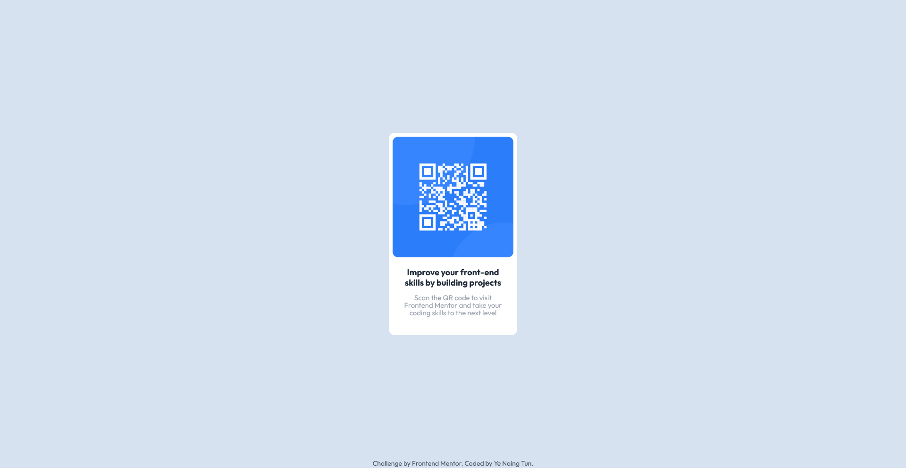

# Frontend Mentor - QR code component solution

This is a solution to the [QR code component challenge on Frontend Mentor](https://www.frontendmentor.io/challenges/qr-code-component-iux_sIO_H). Frontend Mentor challenges help you improve your coding skills by building realistic projects.

## Table of contents

- [Screenshot](#screenshot)
- [Links](#links)
- [Built with](#built-with)
- [Author](#author)

### Screenshot

### Links

- Solution URL: [Add solution URL here](https://www.frontendmentor.io/solutions/responsive-qr-code-with-tailwind-css-DomOUdod5U)
- Live Site URL: [Add live site URL here](https://qr-code-component-mu-teal.vercel.app/)

### Built with

- Semantic HTML5 markup
- [Tailwind CSS](https://tailwindcss.com/) - CSS framework
- Flexbox
- CSS Grid
- Mobile-first workflow

## Author

- Frontend Mentor - [@yenaingtun-dev](https://www.frontendmentor.io/profile/yenaingtun-dev)
- Twitter - [@Sammy*999*](https://twitter.com/Sammy_999_)
